# webclaw 架构分析报告

> 分析对象：`other-ref/webclaw`（Rust workspace，v0.6.x）
> 分析维度：项目定位、workspace 架构、核心抽取、抓取层、LLM 集成、服务层、设计思想

---

## 一、项目定位与核心价值

webclaw 是面向 LLM/AI Agent 的**网页内容提取工具链**，核心定位：

> Turn websites into clean markdown, JSON, and LLM-ready context.
> CLI, MCP server, REST API, and SDKs for AI agents and RAG pipelines.

解决的核心痛点：传统爬虫要么被反爬墙挡住，要么返回充斥 nav/script/ads 的原始 HTML。webclaw 把 URL 转成 LLM 可直接消费的 5 种格式：`markdown` / `json` / `text` / `llm` / `html`。

### 商业模型：open-core

- **OSS 仓库**：CLI、MCP server、自托管 REST server
- **闭源 `api.webclaw.io`**：反爬绕过、JS 渲染、异步任务、多租户等企业特性
- CLI 本地提取失败时通过 `--cloud` 或自动 fallback 走云 API

### 三种部署形态

| 形态 | 入口 | 场景 |
|---|---|---|
| CLI | `webclaw` 命令 | 单次抓取/批量/爬虫 |
| MCP server | `webclaw-mcp` (stdio) | Claude Desktop / Cursor 等 AI agent |
| REST server | `webclaw-server` (axum) | 自托管 API |

三种形态共享同一套底层提取 crate。

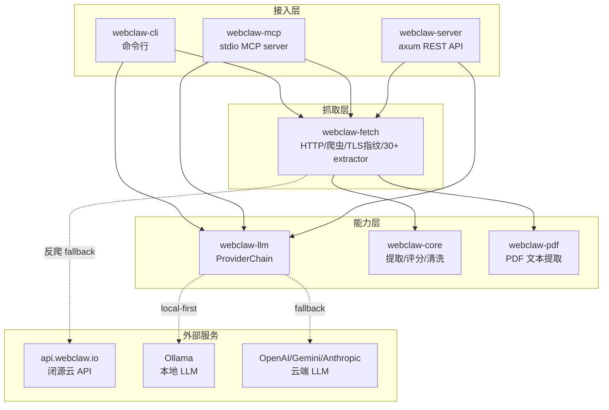

---

## 二、Workspace 架构

### 2.1 Crate 拆分（7 个 crate）

```
webclaw-core     纯提取引擎，零网络依赖，WASM-safe
webclaw-fetch    HTTP 客户端、爬虫、proxy、sitemap、30+ 垂直提取器
webclaw-llm      LLM provider chain（Ollama/OpenAI/Gemini/Anthropic）
webclaw-pdf      PDF 文本提取（无 OCR）
webclaw-mcp      MCP server（stdio 传输，12 个工具）
webclaw-cli      CLI 二进制
webclaw-server   axum REST API（自托管参考实现）
```

### 2.2 拆分原则：按 I/O 边界切

**最重要的硬规则**（CLAUDE.md）：

> Core has ZERO network dependencies — takes `&str` HTML, returns structured output. Keep it WASM-compatible.

- `webclaw-core` 只依赖 `scraper`/`url`，零网络，可上 WASM
- `webclaw-fetch` 独占 `wreq`（BoringSSL TLS 指纹），pin 精确版本 `=6.0.0-rc.29`
- `webclaw-llm` 用普通 `reqwest`（LLM API 不需要 TLS 指纹）
- `webclaw-pdf` 单独发布（pdf-extract 体积大，不污染其他 crate）

### 2.3 依赖关系图

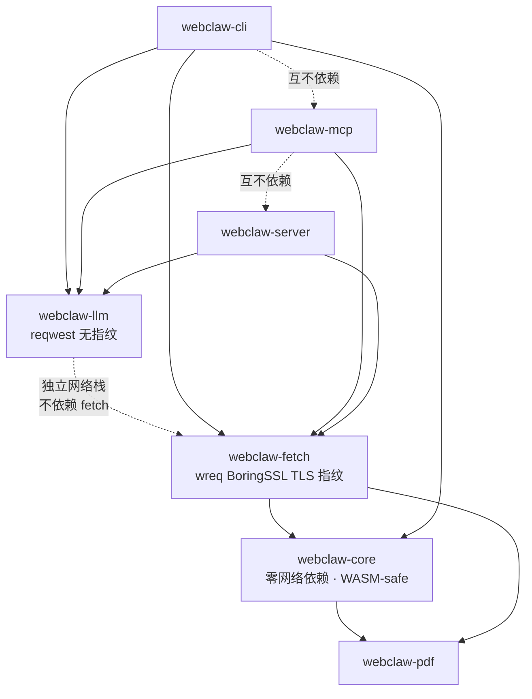

三个二进制 crate 互不依赖，共享底层 crate。`webclaw-llm` 故意不依赖 `webclaw-fetch`——LLM API 用普通 reqwest，不需要 TLS 指纹。

---

## 三、核心抽取引擎（webclaw-core）

### 3.1 抽取流水线

入口：`extract_with_options(html, url, options) -> ExtractionResult`

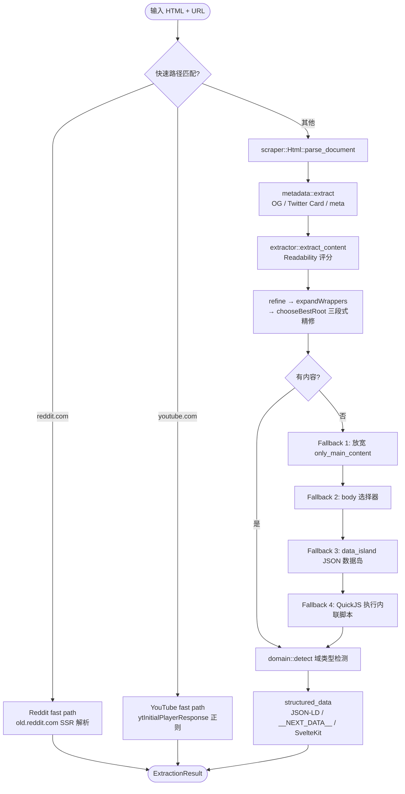

### 3.2 评分函数

```rust
score = text_len.ln()               // 对数压缩，避免长 nav 反超
      + tag_bonus                   // article/main +50, role=main +50
      + class_id_bonus              // content/main/article 等 +25
      + p_count * 3                 // 段落密度
      - link_density_penalty;       // 链接密度惩罚
```

选择最大容器后做 `refine → expandWrappers → chooseBestRoot` 三段式精修。`chooseBestRoot` 向上扫描直到遇到含 `h1` 的祖先——与 fanyi-extension 在 claude.com 7 层嵌套下的解法一致。

### 3.3 噪声过滤（noise.rs）

三层策略：

1. **精确 token 匹配**：class 用 token 精确匹配而非子串（避免 `content-nav` 误判为 nav）
2. **短模式词边界**：≤6 字符的模式用 word-boundary 正则
3. **安全阀**：噪声类元素若 `text > 5000` 字符则不视为噪声（防误杀长 FAQ）

Cookie 同意平台通过 ID 前缀识别（onetrust/optanon/cookiebot/sp_message 等）。Tailwind 工具类通过 `UTILITY_PREFIXES`（`p-`/`m-`/`w-`/`h-`/`text-`/`bg-`）过滤。

### 3.4 LLM 优化流水线（llm/body.rs）

24+ 步管线，顺序至关重要（先解码实体才能让后续正则命中，先去图片再处理链接才能正确识别嵌套图片链接）：

```mermaid
flowchart LR
    subgraph Phase1["阶段 1: 实体与不可见字符"]
        A[decode_html_entities] --> B[strip_invisible_unicode]
    end
    subgraph Phase2["阶段 2: JS/CSS 残留"]
        B --> C[strip_leaked_js]
        C --> D[strip_a11y_link_chrome]
        D --> E[collapse_spaced_text]
    end
    subgraph Phase3["阶段 3: 图片处理"]
        E --> F[convert_linked_images]
        F --> G[collapse_logo_images]
        G --> H[strip_remaining_images]
    end
    subgraph Phase4["阶段 4: 噪声文本"]
        H --> I[strip_emphasis]
        I --> J[strip_ui_control_text]
        J --> K[strip_css_artifacts]
        K --> L[collapse_word_lists]
    end
    subgraph Phase5["阶段 5: 链接与去重"]
        L --> M[extract_and_strip_links]
        M --> N[dedup_repeated_phrases]
        N --> O[dedup_heading_paragraph]
        O --> P[dedup_duplicate_headings]
    end
    subgraph Phase6["阶段 6: 最终整理"]
        P --> Q[collapse_whitespace]
        Q --> R[dedup_content_blocks]
        R --> S[dedup_comma_lists]
        S --> T[merge_stat_lines]
    end
    T --> OUT([LLM-ready text])
```

精巧的清洗子模块：
- `strip_leaked_js`：处理 `self.__wrap_n` 框架水合残留
- `collapse_spaced_text`：CSS `letter-spacing` 渲染的 "S t a r t" → "Start"
- `strip_ui_control_text`：Material Icons 连字、分页文本、箭头 Unicode
- `collapse_word_lists`：200+ 字符、20+ 词、<5% 功能词 → "... and N more"

### 3.5 特殊站点处理

**Reddit**：解析 `old.reddit.com` SSR HTML（稳定 class、无 JS、无需 API key）。评论嵌套用 blockquote 深度（`"> ".repeat(depth)`）而非空格缩进——避免 depth ≥2 时被 CommonMark 误解为缩进代码块。

**YouTube**：正则定位 `ytInitialPlayerResponse`，提取 videoDetails + microformat。还提供 caption tracks 提取和 timed text 解析（刻意不引入 XML crate）。

---

## 四、抓取层与站点适配（webclaw-fetch）

### 4.1 Fetcher trait 解耦

```rust
#[async_trait]
pub trait Fetcher: Send + Sync {
    async fn fetch(&self, url: &str) -> Result<FetchResult, FetchError>;
    fn cloud(&self) -> Option<&CloudClient> { None }
}
```

- OSS 路径：传 `&FetchClient`（wreq + BoringSSL 进程内 TLS 指纹）
- 生产路径：传 `TlsSidecarFetcher`（走 Go tls-sidecar）
- 两个路径产出的 `FetchResult` shape 完全一致，extractor 逻辑零改动

### 4.2 反爬策略

**TLS 指纹**（tls.rs）：基于 wreq + BoringSSL，逐字段匹配真实浏览器

- Chrome 133：JA3 固定 `43067709b025da334de1279a120f8e14`（匹配 bogdanfinn，过 indeed.com WAF 白名单）
- Safari iOS 26：专门为 DataDome immobiliare.it 规则 override 4 个字段（TLS extension order + HTTP/2 HEADERS priority flag）
- Firefox / Edge / Safari 各有独立 profile

**关键设计**：HTTP/2 HEADERS 帧的 `StreamDependency` priority flag 才是 DataDome 真正校验的字段——这是花钱买来的经验。

**云端升级**（cloud.rs）——分层 fallback：

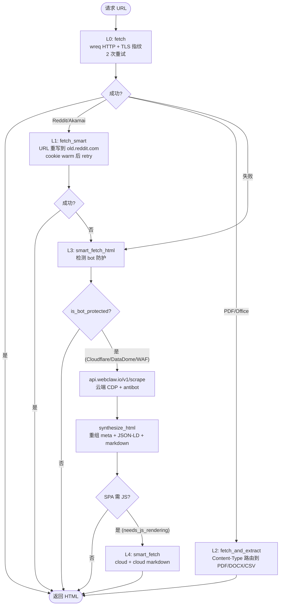

`is_bot_protected` 检测 Cloudflare（`_cf_chl_opt`/Turnstile/`just a moment`）、DataDome、AWS WAF、hCaptcha。

**synthesize_html** 桥接：云端返回结构化数据，本地重组为最小 HTML（meta tags + JSON-LD + markdown in `<pre>`），让 HTML-based extractor 零改动跑云输出。

### 4.3 Extractor 插件机制

**注册**：match 链而非 trait registry（~30 个 extractor，注释说 50+ 才考虑 trait registry）

每个 extractor 三件套：
- `pub const INFO: ExtractorInfo` — name/label/url_patterns
- `pub fn matches(url: &str) -> bool`
- `pub async fn extract(client: &dyn Fetcher, url: &str) -> Result<Value, FetchError>`

**两种分发**：
- `dispatch_by_url`：auto-detect（部分宽匹配的 extractor 故意不放，如 shopify_product/substack_post）
- `dispatch_by_name`：explicit（调用者指定 vertical）

**四层 fallback**：每个 extractor 内部都有 JSON-LD → DOM regex → OG meta → 通用抽取的降级链，返回 `data_source` 字段告知数据来源。

### 4.4 SSRF 防护（三层）

1. **URL 解析**：`validate_public_http_url` 拒绝私有/内网 IP
2. **DNS 解析过滤**：`PublicDnsResolver` 在 wreq DNS 阶段再过滤（防 DNS rebinding）
3. **重定向再校验**：`ssrf_safe_redirect_policy` 每次 302 都重新 validate

覆盖 IPv4（private/loopback/link-local/CGN/multicast）和 IPv6（ULA/link-local/NAT64/文档/嵌入 IPv4）。

### 4.5 爬虫策略

- BFS + `Semaphore` 并发控制
- Scope：same-origin / allow_subdomains / allow_external_links
- Frontier 容量防护：`frontier_cap = max_pages × 10`，超过则 truncate
- ReDoS 防护：`MAX_GLOB_LEN=1024`、`MAX_GLOB_DOUBLESTAR=4`
- 可取消（`AtomicBool`）+ 可恢复（`CrawlState` 序列化）+ 可流式（`broadcast::Sender`）
- Sitemap 集成：crawl 前先 `sitemap::discover` 把 URL 加到 depth=0 frontier

---

## 五、LLM 集成（webclaw-llm）

### 5.1 Provider 抽象

```rust
#[async_trait]
pub trait LlmProvider: Send + Sync {
    async fn complete(&self, request: &CompletionRequest) -> Result<String, LlmError>;
    async fn is_available(&self) -> bool;
    fn name(&self) -> &str;
}
```

四个 Provider 实现差异：

| Provider | 鉴权 | JSON 模式 | 默认模型 |
|---|---|---|---|
| Ollama | 无（本地） | `format: "json"` | `qwen3:8b` |
| OpenAI | Bearer | `response_format` 三档 | `gpt-4o-mini` |
| Anthropic | x-api-key | 无原生（靠 prompt） | `claude-sonnet-4-6` |
| Gemini | x-goog-api-key | `responseMimeType` | `gemini-2.5-flash` |

### 5.2 ProviderChain 装饰器

**ProviderChain 自身也实现 `LlmProvider`**，链和单 provider 在调用方眼中无差别：

```rust
impl LlmProvider for ProviderChain {
    async fn complete(&self, request: &CompletionRequest) -> Result<String, LlmError> {
        for provider in &self.providers {
            match provider.complete(request).await {
                Ok(response) => return Ok(response),
                Err(e) => { errors.push(format!("{}: {e}", provider.name())); }
            }
        }
        Err(LlmError::AllProvidersFailed(errors.join("; ")))
    }
}
```

**默认链顺序**（local-first）：
1. Ollama（本地优先，免费、隐私）
2. OpenAI
3. Gemini（Google Cloud credits 优先于 Anthropic）
4. Anthropic（最后兜底）

```mermaid
sequenceDiagram
    participant Caller as 调用方
    participant Chain as ProviderChain
    participant Ollama as Ollama<br/>(本地)
    participant OpenAI as OpenAI
    participant Gemini as Gemini
    participant Anthropic as Anthropic

    Caller->>Chain: complete(request)
    Note over Chain: providers 非空检查

    Chain->>Ollama: complete(request)
    alt 成功
        Ollama-->>Chain: Ok(response)
        Chain-->>Caller: Ok(response)
    else 失败
        Ollama-->>Chain: Err(e1)
        Note over Chain: warn + 记录错误
        Chain->>OpenAI: complete(request)
        alt 成功
            OpenAI-->>Chain: Ok(response)
            Chain-->>Caller: Ok(response)
        else 失败
            OpenAI-->>Chain: Err(e2)
            Chain->>Gemini: complete(request)
            alt 成功
                Gemini-->>Chain: Ok(response)
                Chain-->>Caller: Ok(response)
            else 失败
                Gemini-->>Chain: Err(e3)
                Chain->>Anthropic: complete(request)
                alt 成功
                    Anthropic-->>Chain: Ok(response)
                    Chain-->>Caller: Ok(response)
                else 失败
                    Anthropic-->>Chain: Err(e4)
                    Chain-->>Caller: Err(AllProvidersFailed<br/>"e1; e2; e3; e4")
                end
            end
        end
    end
```

### 5.3 思考标签清洗

`strip_thinking_tags` 处理 qwen3 等模型的 `<think>...</think>` 标签。extract.rs 和 summarize.rs 在解析前**再次**调用此函数（"defense in depth"）。

### 5.4 Prompt 设计

- **角色设定明确**："You are a X engine"
- **强约束输出**："ONLY valid JSON"、"No explanations, no markdown"
- **温度分层**：抽取=0.0（确定），摘要=0.3（略创造）
- **system + user 双消息**：指令在 system，内容在 user

---

## 六、HTTP Server（webclaw-server）

### 6.1 设计原则

> This is the OSS reference server. It is intentionally small: single binary, stateless, no database, no job queue.

- Axum 0.8，无状态、无 DB、无 job queue
- 10 个 POST 路由 + 2 个 GET
- 硬上限：crawl ≤500 页、batch ≤100 URL、并发 ≤20

### 6.2 路由表

| Method | Path | 功能 |
|---|---|---|
| GET | `/health` | 健康检查（无鉴权） |
| POST | `/v1/scrape` | 单页抓取（5 种格式） |
| POST | `/v1/scrape/{vertical}` | 垂直抽取器 |
| POST | `/v1/crawl` | BFS 爬取 |
| POST | `/v1/map` | sitemap URL 发现 |
| POST | `/v1/search` | Serper.dev 搜索 |
| POST | `/v1/batch` | 并行批量 |
| POST | `/v1/extract` | LLM 结构化抽取 |
| POST | `/v1/summarize` | LLM 摘要 |
| POST | `/v1/diff` | 内容差异对比 |
| POST | `/v1/brand` | 品牌识别（无 LLM） |
| GET | `/v1/extractors` | 列出垂直抽取器 |

### 6.3 安全设计

- **Bearer token 常量时间比较**（`subtle::ConstantTimeEq`）防时序攻击
- **拒绝 0.0.0.0 无鉴权绑定**（除非显式 `WEBCLAW_ALLOW_OPEN_PUBLIC`）
- **入站/出站凭证分离**：`WEBCLAW_API_KEY`（入站）vs `WEBCLAW_CLOUD_API_KEY`（出站）

### 6.4 错误处理

```rust
enum ApiError {
    BadRequest(String),         // 400
    Unauthorized,               // 401
    NotFound,                   // 404
    Fetch(String),              // 502 (upstream)
    Extract(String),            // 422
    Llm(String),                // 422
    Internal(String),           // 500
    NotImplemented(String),     // 501 (部署配置缺失)
}
```

`NotImplemented` 区分"部署配置缺失"（501）与"服务端错误"（500）。

### 6.5 请求处理时序图

以 `POST /v1/scrape` 为例，展示从入站鉴权到响应输出的完整链路。`POST /v1/extract` 和 `/v1/summarize` 在 fetch 之后会进入 LLM chain，时序图中用虚线标注。

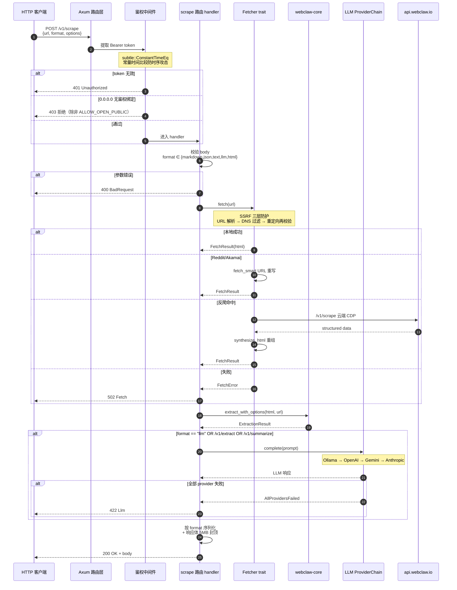

### 6.6 错误码分流图

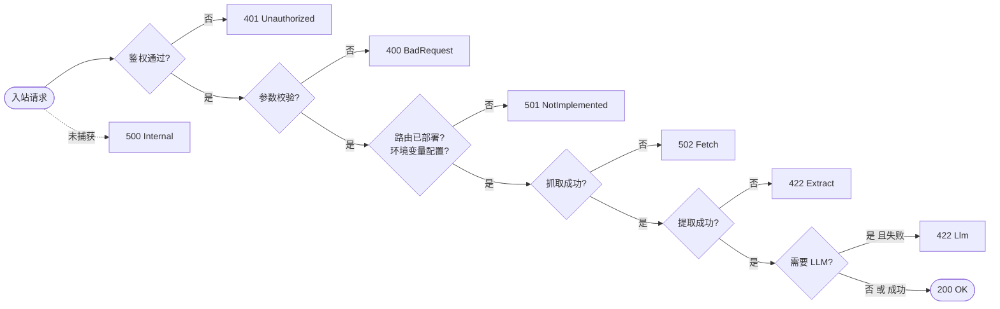

关键点：501 区分"配置缺失"与 500"服务端 bug"，422 区分"上游数据问题"（Extract/Llm）与 502"上游不可达"。

---

## 七、MCP Server（webclaw-mcp）

### 7.1 设计

- 基于 `rmcp` crate，stdio transport
- 日志走 stderr（stdout 是 MCP 传输通道）
- 12 个 tools：scrape/crawl/map/batch/extract/summarize/diff/brand/research/search/list_extractors/vertical_scrape

### 7.2 关键设计

**三个客户端的差异化缓存**：
- Chrome 客户端：复用 `fetch_client`
- Firefox 客户端：`OnceLock` 懒构建（Reddit 封 Chrome TLS 指纹时用）
- Random：每次构建（指纹轮换）

**LLM chain 启动时构造一次**（与 server 的 per-request 构造不同）。

**容错设计**：处理 MCP 客户端的"数字传成字符串"问题（`deser_opt_u32_or_str`），应对不同 MCP 客户端的序列化差异。

**Research 工具**：唯一需要 cloud 的异步 job，轮询 ~10min，结果落盘 `~/.webclaw/research/` + 缓存。slugify 是 char-safe 的（CJK 多字节字符不会 panic）。

### 7.3 MCP 工具调用时序图

以 `scrape` 工具为例，展示 MCP 客户端 → stdio → server → fetcher/core 的完整调用链。stdio 是传输通道，所以日志必须走 stderr。

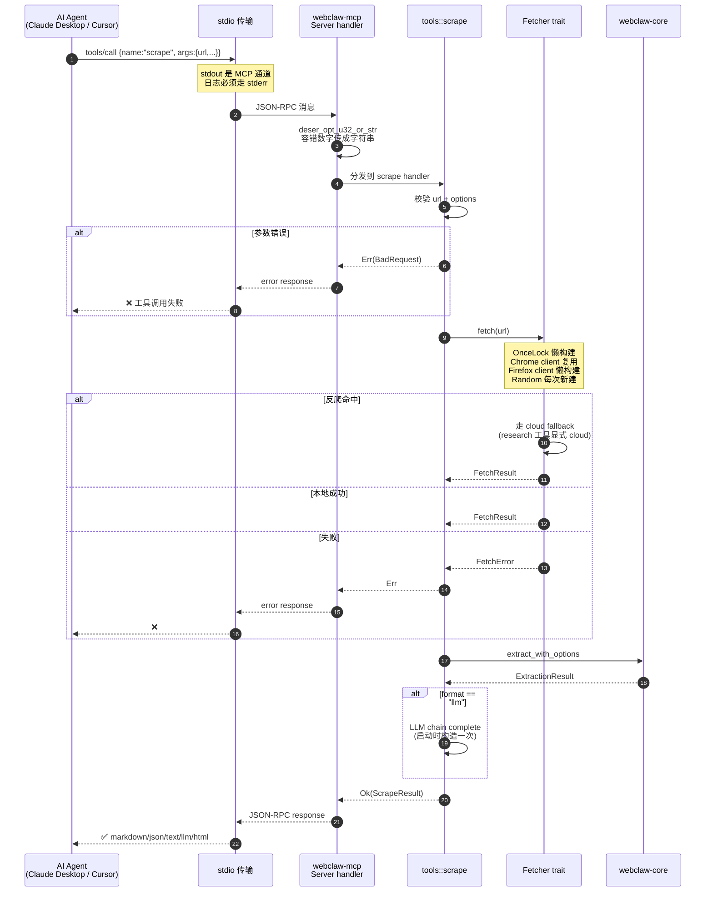

### 7.4 Research 异步 job 时序图

`research` 是唯一需要 cloud 的异步工具，单次轮询 ~10 分钟。结果落盘 `~/.webclaw/research/` 后再次调用直接命中缓存。

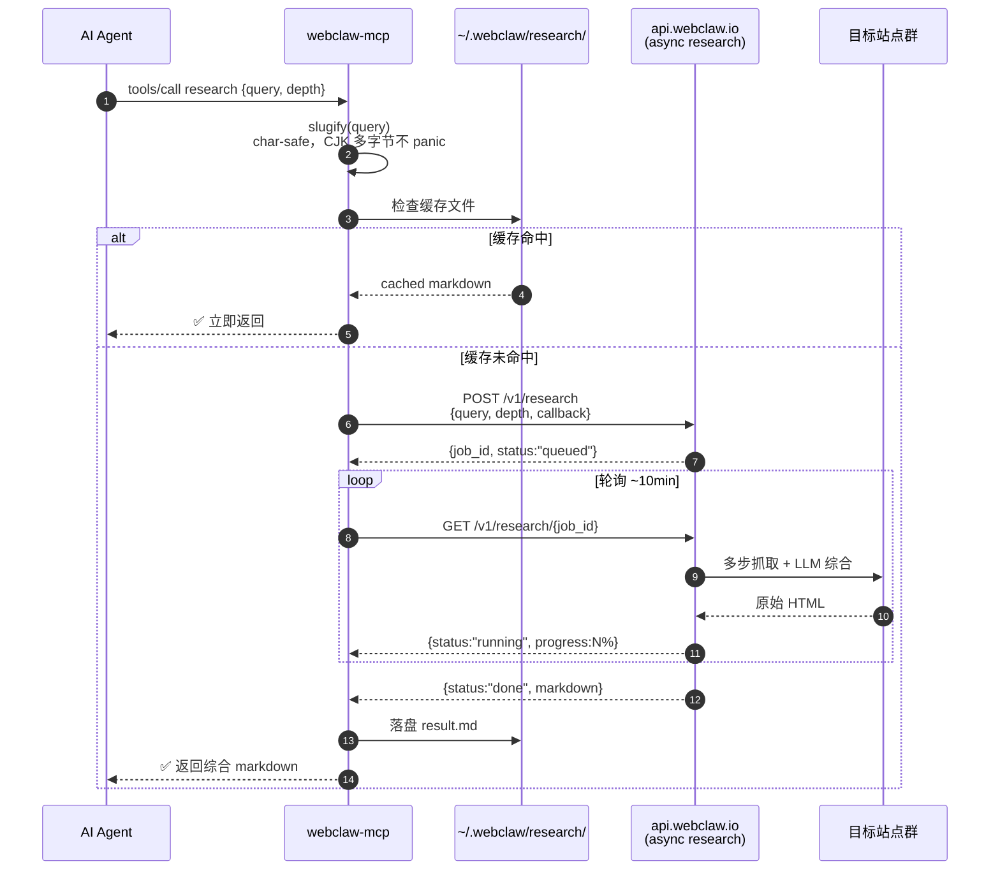

### 7.5 三种客户端构建策略对比

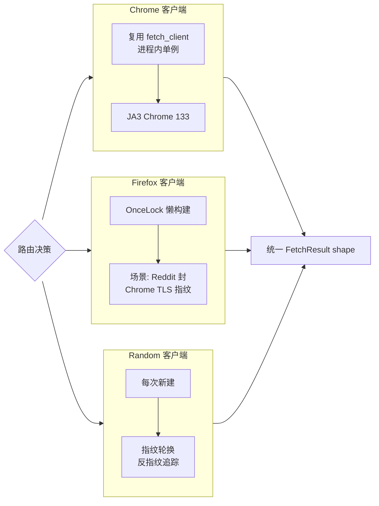

三个客户端产出 shape 一致，extractor 无需感知后端差异。

---

## 八、设计思想总结

### 8.1 核心模式

1. **按 I/O 边界切 crate** — core 零网络可上 WASM，fetch 独占 wreq 指纹栈，llm 独立 reqwest
2. **Trait 抽象解耦** — Fetcher trait 让 OSS 和生产 server 用不同 TLS 后端但共享提取器；LlmProvider trait + ProviderChain 装饰器让本地/云端 LLM 透明切换
3. **Local-first + 云端兜底** — LLM 链 Ollama 优先，抓取本地优先遇反爬才走 cloud
4. **多层安全阀** — 噪声类 >5000 字符豁免、`MAX_DOM_DEPTH=200`、`MAX_SCAN_BYTES=8MB`、PDF 50MB 上限
5. **精确匹配优先于子串** — class token 精确匹配、cookie 平台 ID 前缀匹配
6. **防御性编程** — SSRF 三层防护、响应体 5MB 封顶、Gemini model name 路径注入防御、bearer 常量时间比较
7. **明确区分 OSS vs Hosted** — server 注释反复强调"stateless, no DB, no job queue"
8. **BYO-key 哲学** — search 用操作者自己的 Serper key，LLM 用操作者自己的 OpenAI/Anthropic key

### 8.1.1 核心设计模式关系图

8 个核心模式按"架构 / 解耦 / 容错 / 边界"四层组织，模式之间相互支撑：

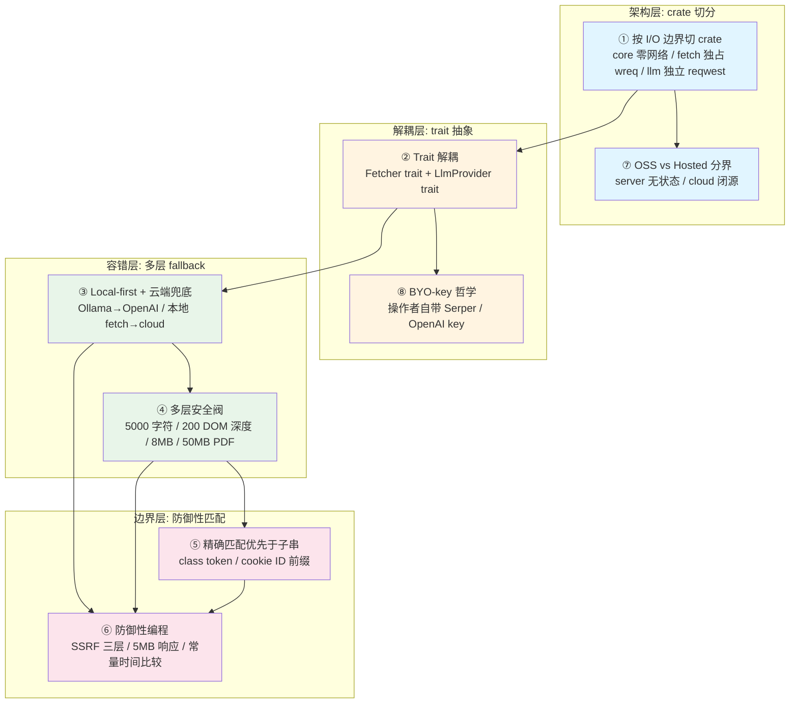

### 8.2 工程化亮点

- **注释解释"为什么"而非"是什么"** — 每个设计决策都有注释说明动机
- **测试覆盖充分** — 含真实 bug 回归测试（qwen3 `/think` 泄漏、CJK slugify panic、Express.co.uk 栈溢出）
- **基准测试双轨** — CLI 微基准（近似 tokenizer）+ 完整跨工具对比（真实 tiktoken）
- **facts.json 社区可维护** — 基准数据是 commit 的数据资产，可 PR 添加

### 8.3 与 fanyi-extension 的共鸣

webclaw-core 的多个设计与 fanyi-extension 踩过的坑高度一致：

| 问题 | webclaw 解法 | fanyi-extension 解法 |
|---|---|---|
| claude.com 7 层嵌套根节点 | chooseBestRoot 向上扫到 h1 | chooseBestRoot 向上扫到 h1 |
| cookie modal 误判 | ID 前缀匹配 + textContent 安全阀 | isConsentSdkContainer 匹配 plain "cookie" |
| Tailwind class 误匹配 | UTILITY_PREFIXES 过滤 | tokenizeClass 排除 `:` 和 `[` |
| LLM 输出 ```json 包裹 | stripMarkdownCodeBlock | stripMarkdownCodeBlock |
| 模型截断 JSON | repairTruncatedJson | repairTruncatedJson |

说明这些问题具有跨实现的普遍性，webclaw 的解法值得借鉴。

---

## 九、对 fanyi-extension / vocal-saga 的借鉴

> 章节定位：把 webclaw 报告里"看着不错"的设计落到 fanyi-extension / vocal-saga 的具体改动上，按优先级分级。
> P0 = 修复已知 bug 风险；P1 = 提升鲁棒性；P2 = 边际收益可选。

### 9.1 核心抽取引擎（webclaw-core）

#### P0 · data_island fallback（缺失路径）

webclaw 抽取流水线的 fallback 链：放宽 only_main_content → body → **data_island JSON 数据岛** → QuickJS 执行内联脚本。

fanyi-extension 当前只有"fallback 到 body"。许多 SPA 站点（Next.js / Nuxt / SvelteKit）把真正的内容塞在 `<script type="application/json">` / `__NEXT_DATA__` / `__NUXT__` 里，DOM 是空的。当前实现会 miss，导致翻译失败。

建议：在 contentHelper.ts 的 fallback 路径加 `extractFromDataIsland()`，扫描 `script[type="application/json"]` + `#__NEXT_DATA__` + `#__NUXT_DATA__`，解析后从结构化数据回填 textContent。

#### P0 · collapse_spaced_text（已知现象未处理）

CSS `letter-spacing` 渲染的 "S t a r t" → "Start"。hero section、CTA 按钮、品牌名常见此样式。当前 fanyi-extension 直接 textContent 抽取，会把 "S t a r t" 作为独立 block 翻译成 "开 始"，apply 回 DOM 后中文字符间也保留空格，视觉错乱。

建议：在 blockExtractor.ts 抽取后加 `collapseSpacedText()`：检测连续单字符 + 空格模式，合并为单词。阈值：≥4 个连续单字符 + 空格序列。

#### P1 · noise.rs 三层策略（当前只有一层）

webclaw 噪声过滤三层：精确 token 匹配 + ≤6 字符 word-boundary 正则 + 5000 字符安全阀。

fanyi-extension 的 `isConsentSdkContainer` 已有 ID 前缀匹配（一层），但缺：
- **短模式词边界**：`nav` 这种 3 字符模式若用子串匹配会误伤 `navy`/`gnave`。建议在 contentHelper 的 class token 匹配处统一用 `\bnav\b`。
- **5000 字符安全阀**：噪声类元素若 `text > 5000` 字符则不视为噪声，防误杀长 FAQ。fanyi-extension 已踩过 `#cookiesModal` 50k 字符反超的坑，但当前是靠规则修复单点，缺统一安全阀。

#### P1 · structured_data 路由

webclaw 在 metadata 之后并行跑 `structured_data`（JSON-LD / __NEXT_DATA__ / SvelteKit）。fanyi-extension 当前完全不消费结构化数据，SPA 站点（如 vercel.com 文档站）正文 0 字符时无降级路径。

建议：与 9.1 的 data_island fallback 合并实现——data_island 是结构化数据的一种，统一一个 `extractStructured()` 入口。

#### P2 · ln() vs 线性封顶（已接近，不建议改）

webclaw `score = text_len.ln()`；fanyi-extension `Math.min(30, textLength / 800)`。

数学上：ln(8000) ≈ 8.99，ln(24000) ≈ 10.09；fanyi-extension 8000 字 +10、24000 字 +30（封顶）。两者在中等长度接近，但 fanyi-extension 封顶后长 nav 仍可能拿满 +30 反超短 article 的 +50 tag bonus。

借鉴价值：**有限**。fanyi-extension 的分段线性已覆盖 90% 场景，改 ln() 收益小且会破坏现有 reasons 日志可读性。

#### P2 · 24 步 LLM 清洗管线（过度工程风险）

webclaw llm/body.rs 24+ 步顺序清洗：decode_html_entities → strip_invisible_unicode → strip_leaked_js → strip_a11y_link_chrome → collapse_spaced_text → convert_linked_images → collapse_logo_images → strip_remaining_images → strip_emphasis → strip_ui_control_text → strip_css_artifacts → collapse_word_lists → extract_and_strip_links → dedup_repeated_phrases → dedup_heading_paragraph → dedup_duplicate_headings → collapse_whitespace → dedup_content_blocks → dedup_comma_lists → merge_stat_lines。

顺序约束：先解码实体才能让后续正则命中；先去图片再处理链接才能识别嵌套图片链接。

借鉴价值：**部分借鉴**。fanyi-extension 翻译的是 block 文本而非整页 markdown，不需要这么多步。但以下几步独立价值高：
- `strip_leaked_js`：处理 `self.__wrap_n` 框架水合残留
- `collapse_logo_images`：logo 通常是品牌名，翻译破坏识别
- `dedup_content_blocks`：SEO 站点重复段落去重，省 LLM token
- `collapse_word_lists`：200+ 字符、20+ 词、<5% 功能词 → "... and N more"，导航/标签云翻译无意义且占 token

建议：按需 cherry-pick，不整套移植。

### 9.2 LLM 集成

#### P0 · strip_thinking_tags defense in depth

webclaw extract.rs 和 summarize.rs 在 JSON.parse 前**再次**调用 `strip_thinking_tags`，注释写 "defense in depth"。

fanyi-extension 当前只在 NVIDIA 服务里调 `stripMarkdownCodeBlock`，没处理 qwen3 / deepseek-r1 等推理模型的 `<think>...</think>` 标签泄漏。一旦模型把 thinking 内容包进 ```json 块，JSON.parse 立刻爆炸。

建议：在 shared.ts 加 `stripThinkingTags()`，所有 service 的 callApi 在 stripMarkdownCodeBlock 之前调用。

#### P0 · 响应体 5MB 封顶

webclaw client 和 server 都对响应体封顶 5MB，防内存爆炸。fanyi-extension 的 serverTranslation.ts 直接 `fetch().text()` 无封顶，恶意/异常服务端返回超大 body 会 OOM。

建议：在 shared.ts 的 callApi 加 `MAX_RESPONSE_CHARS = 5_000_000`，超过则截断 + warn。

#### P0 · 501 NotImplemented 错误码

webclaw 区分 501（配置缺失）vs 500（服务端 bug）。fanyi-extension 当前所有 server 错误都 500，客户端无法区分"服务端没配 NVIDIA key"（用户应换 provider）vs"NVIDIA 真的挂了"（应重试）。

建议：vocal-saga 在 router 层加 `NotImplementedError`，环境变量缺失时返回 501，客户端据此自动切换 provider。

#### P1 · detect_empty 早期 bail

webclaw 当所有 block 翻译后与原文相同时 warn。fanyi-extension 的 NvidiaTranslationService 已有类似 warn，但仍把结果 apply 到 DOM。

建议：检测到 ALL unchanged 时直接 throw，让客户端走 fallback（切 provider 或显示原错误），避免用户看到"翻译成功但页面没变"的诡异状态。

#### P2 · ProviderChain 装饰器（架构性改动）

webclaw ProviderChain 自身实现 LlmProvider trait，nvidia 失败自动 fallback 到 deepseek。

fanyi-extension 当前是 service 字段显式路由（`provider: 'nvidia' | 'deepseek' | 'openrouter'`），无 fallback。改成 chain 是架构性改动，收益是单点故障容错，成本是配置面变复杂。

建议：**暂缓**。当前用户手动选 provider 已能满足需求，引入 chain 后"为什么用了 nvidia 但扣了 deepseek 钱"会成为新支持成本。

#### P2 · temperature 分层

webclaw 抽取=0.0（确定），摘要=0.3（略创造）。fanyi-extension 翻译固定 0.1。

借鉴价值：**有限**。glossaryExtractor 抽取术语可降到 0.0 提升一致性；标题翻译可升到 0.3 提升文采。但 0.1 已是合理默认值，分层收益小。

### 9.3 工程化

#### P1 · 基准测试双轨

webclaw benchmarks 双轨：CLI 微基准（近似 tokenizer，快速反馈）+ 完整跨工具对比（真实 tiktoken，权威）+ facts.json（18 站点 90 facts，commit 数据资产）。

fanyi-extension 当前只有单元测试，每个站点改动靠手动验证。claude.com 7 层嵌套修复后没有跨站点回归保护，下次重构可能再次踩坑。

建议：建立"已知难站点"快照目录 `tests/fixtures/sites/`，每个站点存 HTML 快照 + 期望 block 列表 + 期望根节点。PR 跑抽取回归。优先收录：openai.com / claude.com / tailwindcss.com / vercel.com / reddit.com。

#### P1 · slugify char-safe

webclaw slugify 是 char-safe 的，CJK 多字节字符不会 panic。vocal-saga 的缓存 key 可能用到 slugify（按 URL 缓存翻译）。

建议：检查 vocal-saga 的 cache key 生成，确认 CJK URL 不会因 char index 越界 panic。

#### P2 · deser_opt_u32_or_str 容错

webclaw 应对不同 MCP 客户端序列化差异，数字字段同时接受 number 和 string。

fanyi-extension config 面板从 `browser.storage` 读数字时也有类似问题——用户手动改 storage 或扩展版本升级后 schema 不匹配，数字字段可能变成 string。

建议：config loader 加 `asNumberOrDefault()`，宽容处理。收益小但成本低。

#### P2 · 注释解释"为什么"

webclaw 每个设计决策都有注释说明动机（"HTTP/2 HEADERS 帧的 StreamDependency priority flag 才是 DataDome 真正校验的字段——这是花钱买来的经验"）。

fanyi-extension 已有此风格（contentHelper 的 reasons 数组），可推广到 serverTranslation.ts、shared.ts 等文件。

### 9.4 反爬/网络（按需借鉴）

#### P1 · synthesize_html 桥接（vocal-saga 服务端）

webclaw 云端返回结构化数据，本地 `synthesize_html` 重组为最小 HTML（meta tags + JSON-LD + markdown in `<pre>`），让 HTML-based extractor 零改动跑云输出。

vocal-saga 服务端翻译当前直接处理 fetch 回来的 HTML，遇到 SPA（DOM 空）时无降级。可借鉴：服务端 fetch 失败时检测是否 SPA，若是则调 cloud API 拿结构化数据，synthesize 后走现有 pipeline。

#### P2 · fetch_smart URL 重写（vocal-saga reddit）

Reddit 翻译时 vocal-saga 可考虑走 `old.reddit.com`——稳定 SSR HTML，无 JS 反爬。webclaw 已验证此路径。

#### P2 · is_bot_protected 错误信息

vocal-saga 服务端 fetch 失败时检测 Cloudflare/DataDome 关键字（`_cf_chl_opt`/Turnstile/`just a moment`），给用户更明确的错误信息（"目标站点启用了反爬，请尝试其他源"）而非泛泛的"fetch failed"。

### 9.5 借鉴优先级矩阵

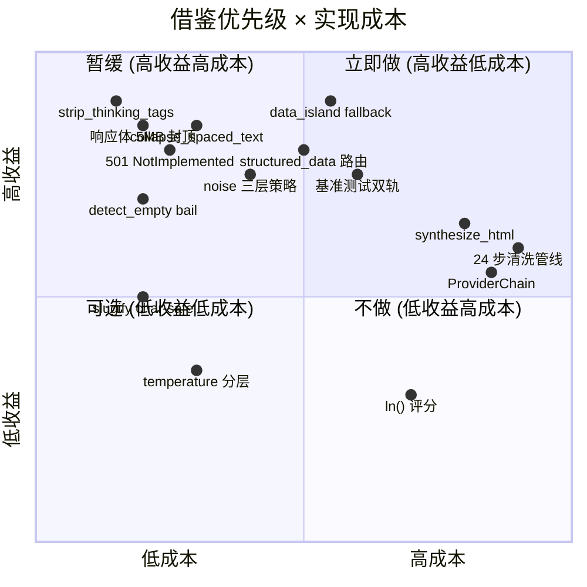

### 9.6 建议落地路径

```mermaid
flowchart LR
    subgraph P0["P0: 立即做（1-2 周内）"]
        A1[strip_thinking_tags<br/>shared.ts]
        A2[响应体 5MB 封顶<br/>shared.ts callApi]
        A3[501 NotImplemented<br/>vocal-saga router]
        A4[collapse_spaced_text<br/>blockExtractor.ts]
        A5[detect_empty bail<br/>NvidiaTranslationService]
    end

    subgraph P1["P1: 短期（1 个月内）"]
        B1[data_island fallback<br/>contentHelper.ts]
        B2[structured_data 路由<br/>与 B1 合并实现]
        B3[noise 三层策略<br/>contentHelper.ts]
        B4[基准测试双轨<br/>tests/fixtures/sites/]
        B5[synthesize_html<br/>vocal-saga 服务端]
        B6[slugify char-safe<br/>vocal-saga cache]
    end

    subgraph P2["P2: 可选（按需）"]
        C1[24 步清洗<br/>cherry-pick 4 步]
        C2[deser_opt_u32_or_str<br/>config loader]
        C3[fetch_smart<br/>reddit.com 翻译]
        C4[is_bot_protected<br/>错误信息]
    end

    P0 --> P1 --> P2
```

---

## 关键文件路径

```
other-ref/webclaw/
├── CLAUDE.md                          # 架构权威文档
├── Cargo.toml                         # workspace 根
├── benchmarks/
│   ├── methodology.md                 # 基准方法论
│   └── facts.json                     # 18 站点 90 facts
└── crates/
    ├── webclaw-core/src/
    │   ├── lib.rs                     # 提取流水线入口
    │   ├── extractor.rs               # Readability 评分
    │   ├── noise.rs                   # 噪声过滤
    │   ├── markdown.rs                # HTML→markdown
    │   ├── types.rs                   # 核心类型
    │   ├── llm/body.rs                # 24 步 LLM 清洗
    │   ├── llm/cleanup.rs             # 清洗子模块
    │   ├── reddit.rs                  # Reddit 特殊处理
    │   └── youtube.rs                 # YouTube 特殊处理
    ├── webclaw-fetch/src/
    │   ├── fetcher.rs                 # Fetcher trait
    │   ├── client.rs                  # FetchClient
    │   ├── tls.rs                     # TLS 指纹
    │   ├── cloud.rs                   # 云端升级
    │   ├── url_security.rs            # SSRF 防护
    │   ├── crawler.rs                 # 爬虫
    │   └── extractors/                # 30+ 垂直提取器
    ├── webclaw-llm/src/
    │   ├── provider.rs                # LlmProvider trait
    │   ├── chain.rs                   # ProviderChain 装饰器
    │   └── providers/                 # 4 个 provider
    ├── webclaw-server/src/
    │   ├── main.rs                    # server 入口
    │   ├── state.rs                   # 状态管理
    │   ├── auth.rs                    # 认证
    │   └── routes/                    # 10+ 路由
    └── webclaw-mcp/src/
        ├── main.rs                    # MCP 入口
        ├── server.rs                  # MCP server
        └── tools.rs                   # 12 个 tools
```
